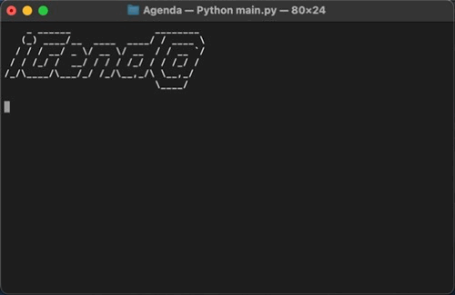
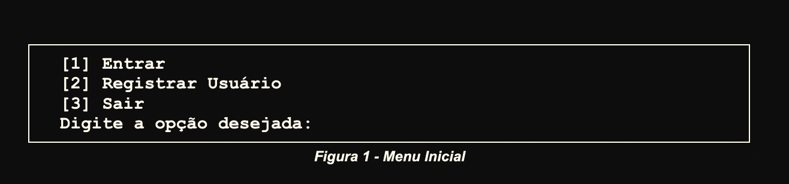
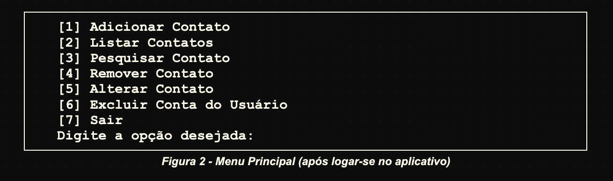

# Projeto final de APE - IFPB

## Olá! 👋

Este é o projeto final da disciplina de Algoritmos e Programação Estruturada - IFPB.

## Descrição do projeto

O objetivo é desenvolver uma agenda telefônica, onde seja possível cadastrar mais de um usuário e cada usuário possa ter acesso a sua agenda.

Todas as manipulações de dados devem ser feitas arquivo texto, onde cada usuário tem um arquivo da agenda e um onde fica armazenada a senha.

Clique para ler a [descrição completa](./assets/2022.2%20-%20Projeto%20APE%20-%20iGend%40.pdf)do projeto.

**Menu inicial:**

Este é o primeiro menu que usuário tem acesso, nele é possível:

1. Entrar caso já exista um usuário cadastrado
2. Registrar um novo usuário
3. Encerrar o programa

**Menu principal:**

Após a entrada do usuário, ele será direcionado para este menu. As opções deste menu restringem-se apenas à sua própria agenda e conta.

## Considerações finais

É um projeto muito interessante e apesar de ser uma disciplina de introdução à programação, devido ao grande número de funções e as manipulações com os arquivos, tem um nível de dificuldade bem mais elevados que os exercícios abordados em sala, por exemplo. Quebrei bastante a cabeça, mas no fim das contas foi possível consolidar vários conceitos básicos mas que são importantíssimos, como estruturas de controle, laços de repetições, funções e recursos de Python.
